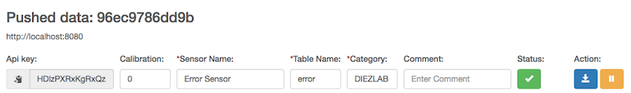

# Online raspberry pi temperature sensors

This web app is a frontend intended to run on a raspberry pi equipped with
temperature sensors that are addressed via the 1 wire protocol.
The hard-and software setup was inspired by [ModMyPi](https://www.modmypi.com/blog/ds18b20-one-wire-digital-temperature-sensor-and-the-raspberry-pi). Thanks a lot for that great tutorial.

Check out [the tags page](https://gitlab.com/Thawn/pitemplog/tags) for releases and sd-card image download links.

Jump directly to:
* [Hardware setup](#hardware)
* [Software installation](#installation)
* [Configuration](#config)

## Features
* Data logged in partitioned mysql database -> fast access even if millions of data points are stored
* Responsive web frontend based on bootstrap and jQuery -> optimized for desktop and mobile clients
* Adaptive charts powered by amCharts javascript library
* Export charts as png or svg
* Download selected (or all) data as CSV
* Static html pages and javascript generated by jekyll -> good performance because most code is run in client browser not on raspberry pi
* Easy software setup via ready to go raspbian-lite-based image
* Simple and expandable hardware setup
* Low power consumption by raspberry pi
* Flexible and easy setup of data sharing between several raspi sensor hubs so that all data can be visualized via one web frontend and data is backed up between several raspberry pi systems.
* Backup of data and configuration via rsync to centralized server possible with minimal configuration effort via backup scripts.

## Screen shots

### Overview Page for Multiple Sensors


### Frontend Desktop


### Frontend Mobile


### Frontend Tablet


see also the [configuration screenshot](#configuration-screenshot).

## Hardware setup<a name="hardware"></a>
### Material


* Raspberrypi 2 or 3 Model B
* SD card with at least 2GB capacity
* External usb harddisk (or a usb stick that uses wear leveling). If you don't want to use an external harddisk use the "nousb" image or follow the [manual installation instructions](#manual) below.
* One-wire digital thermometer(s): DS 18B20
* 4.7K Ohm resistor
* 3x jumper contacts (or 2x 2W 245 PSK plug)
* min 2x 3-pin matching plug and socket (you'll need one more set than the number of sensors you want to connect, i.e for two sensors you need three, for three sensors four etc.)
* Cable with three wires
* soldering equipment
* shrink-on tubing

### Assembly
All soldering points should be insulated with individual shrink-on tubings. Then
add one large shrink-on tubing around to protect and keep the wires together.
1. Connect one of the 3-pin plugs to the raspi (see [picture below](#connect-to-raspi)):
   1. wire 1 (black) to ground (PIN9 on the [Raspi GPIO pins](https://pinout.xyz))
   2. wire 2 (brown) to BCM4/GPIO4 (PIN 7)
   3. wire 3 (red) to 3.3V Power (PIN 1)
2. Add the 4.7K Ohm resistor between 3.3V and BCM4/GPIO4 (PIN1 and PIN7) 
3. Solder the wires of the cable to the thermometer (see [picture below](#sensor-pinout) Note: In the front view of the sensor (on the left of the image) the pins are facing towards you). In this example, the cable has white green and red wires. For example:
   1. white to pin 1: GND
   2. green to pin 2: DQ
   3. red to pin 3: V<sub>DD</sub>
4. solder the other end of the cable to the 3-pin socket:
   1. White to pin 1 (corresponds to black wire on the plug)
   2. green to pin 2 (corresponds to brown lead on the plug)
   3. red to pin 3 (corresponds to red lead on the plug)
4. solder the wires of another plug parallel to the socket (see [picture below](#assembled-sensor)):
   1. black to pin 1
   2. brown to pin 2
   2. red to pin 3 

Now you can connect many thermometers to the raspi as each thermometer will add
its own plug such that all thermometers are connected in parallel.
Theoretically, you can add as many thermometers as you like (at least several
tens of thermometers should work) and the cables can be tens or even more than a
hundred meters long. In my setup I successfully tested up to 5 thermometers with
a total of 50 meters of cable. However, at some point too much cable will
deteriorate the signal so much that thermometers are not found any more or
randomly disappear. See [here for recommendations on setting up large sensor networks](https://www.maximintegrated.com/en/app-notes/index.mvp/id/148).
Check out the [picture of the final assembly](#final-assembly).

#### Connect to Raspi


#### Sensor Pinout


Note: In the front view of the sensor (left) the pins are facing towards you.

#### Assembled Sensor


#### Final Assembly


## Installation
Jump directly to:
* [Install from image](#install-from-image)
* [Manual installation](#manual)
* [Lightweight installation (used for image creation)](#light)
* [Updating an image with fresh source code](#updating-an-image-with-fresh-source-code)
* [Dependencies](#deps)

### Install from image
1. Download the image from [the tags page](https://gitlab.com/Thawn/pitemplog/tags).
1. Flash the image files to the sd card for example using [etcher](https://etcher.io/).
1. You may want to [enable ssh](https://www.raspberrypi.org/documentation/remote-access/ssh/) by putting a file named ssh on the boot partition. Don't forget to change the password using raspi-config after you boot up the raspi and ssh into it using the default username `pi` and password `raspberry`.
1. Insert the sd card into the raspi.
1. Connect the usb disk to the raspi.
1. Connect a power cable to the raspi. The raspi will boot up and copy some files onto the usb disk. Do not power down the raspi or disconnect the usb disk until the green lights on the raspi and the activity lights on the usb disk stop blinking. **Warning!!! This will overwrite all data on the first partition of the usb disk!!!**
1. See [Hardware setup](#hardware) for how to connect the temperature sensors
1. See [Configuration](#config) for how to configure the web frontend and start logging data.
1. Done!

### Manual installation<a name="manual"></a>
1. [Download](https://www.raspberrypi.org/downloads/raspbian/) and [install](https://www.raspberrypi.org/documentation/installation/installing-images/README.md) raspbian-lite onto a micro sd card
1. [Enable ssh](https://www.raspberrypi.org/documentation/remote-access/ssh/) by putting an empty file named `ssh` onto the boot partition of the sd card
1. Insert the sd card into the raspberry pi and connect the power cable in order to start the raspi
1. Figure out the IP address of the raspi either from your router's web interface or by connecting a monitor to the raspi. It will tell you it's ip address at bootup. With some routers you can also use the hostname `raspberrypi` to connect to the raspi.
1. Log into the raspi via ssh: `ssh p@<ip address>`
1. add the following lines to `/boot/config.txt`:
```bash
dtoverlay=w1-gpio,gpiopin=4,pullup=on
max_usb_current=1
```
7. Configure at the following settings using `sudo raspi-config`:
   * password (`Change User Passowrd`; !!!this is important!!!)
   * hostname (`Network Options`)
   * locale and timezone (`Localisation Options`)
   * memory split (`Advanced Options->Memory Split->16`; this leaves more memory for the webserver and database)
   * say yes when the program asks to reboot.
1. Update the debian system: `sudo apt-get update && sudo apt-get dist-upgrade`
1. Install required packages: `sudo apt-get install mysql-server php php-mysql php-curl python-mysqldb python-pip grunt npm git`
1. In Debian, jekyll depends on xdg-utils which in turn recommends to install the x-server, which in our case is totally unnecessary. Therefore we install jekyll with the *--no-install-recommends* option: `sudo apt-get install jekyll --no-install-recommends`
1. Install PyYAML: `sudo pip install pyyaml`
1. Delete the symlink to the default apache configuration: `sudo rm /etc/apache2/sites-enabled/000-default.conf`
1. Clone the git repository: `git clone --depth=1 https://gitlab.com/Thawn/pitemplog.git`
1. Enter the source directory: `cd temperatures`
1. Install the required node modules: `npm install`
1. Compile and install the temperature logger and web frontend: `grunt install`
1. Create a mysql database and a user with full privileges for that database. If you want to create the default database and user, you can use this command: `sudo mysql < _src/_bin/create_database.sql`
1. At this point, it is highly recommended that you move the mysql database directory to an external hard disk because frequent writes to the database file will eventually corrupt the SD card (SD cards only last about 100.000 write cycles, which corresponds to about 80 days if you write to the database every minute. I have had several SD cards fail on me because of this).
   1. Attach a usb harddisk (or a usbstick that supports wear leveling) to the raspi
   1. Make sure the harddisk has at least one partition and that you don't need any of the data on it.
   1. This step will **overwrite the harddisk in /dev/sda1** so make sure that is the **correct one** and that you **don't need the data on there any more**!!! `/usr/local/share/templog/_sbin/setup_usb_storage.sh`
1. Reboot the raspi with `sudo reboot`
1. See [Hardware setup](#hardware) for how to connect the temperature sensors
1. See [Configuration](#config) for how to configure the web frontend and start logging data.
1. Done!

### Lightweight installation (used for image creation)<a name="light"></a>
In this case we deploy from a separate machine. That way, we don't need to install the [development dependencies](#devdeps) on the raspi.
1. Follow the [manual installation instructions](#manual) until step 8.
1. Instead of step 9 install only the [minimal dependencies](#deps): `sudo apt-get install mysql-server php php-mysql php-curl python-mysqldb python-pip`.
1. Continue to follow the manual installation until step 12.
1. On your development machine install the [development dependencies](#devdeps). On a debian machine: `sudo apt-get install python-pip grunt npm git jekyll`.
1. Steps 13 - 15 are done on your development machine.
1. Deploy the logger and web frontend by running the following on your development machine: `grunt deploy --host=<ip address or hostname of your raspi>`.
1. Now continue ssh back into the raspi and continue there: `sudo mysql < /usr/local/share/templog/_bin/create_database.sql`.
1. If you want to use an external harddisk (recommended!): `sudo /usr/local/share/templog/_sbin/setup_usb_storage.sh`. This will cause the raspi to format and set up an external harddisk the first time it is available during boot. On subsequent boots, the harddisk is not formatted but must be available otherwise the database will not run (because its data is stored on the harddisk).
1. In order to save space, we uninstall pip: `sudo apt-get remove python-pip`.
1. Now we clean up unused packages and package files: `sudo apt-get autoremove && sudo apt-get clean`. With Raspbian Stretch Lite (2017-11-29) there was 1.4GiB used on the root partition of my raspi. The gzipped image will be considerably smaller (<500 MiB).
1. The following steps can be skipped if you don't want to create an image:
   1. Make sure the filesystem is resized to fill the entire sd card at next reboot: `sudo /usr/local/share/templog/_sbin/resize_root.sh`
   1. Overwrite free space with zeros to reduce the image file size later:
   ```bash
   sudo -s
   dd if=/dev/zero of=zero.small.file bs=1024 count=102400
   cat /dev/zero > zero.file
   sync
   rm zero.small.file
   rm zero.file
   ```
   3. Disable ssh: `sudo update-rc.d ssh disable`.
   1. Shutdown the raspi: `sudo halt`.
   1. Connect the sd card to your development machine.
   1. Shrink the ext4 partition to ~1900MB using gparted (to allow installation on a 2GB sd card).
   1. Identify the sd card with `parted -l`
   1. Create an image (important: use the sd card device not the partition. i.e. use /dev/sdc and not /dev/sdc1): `sudo dd if=<sd card device> bs=1m count=2000 | gzip > raspi-templog.img.gz`.

### Updating an image with fresh source code
This only works on a linux development machine (I am using an Ubuntu virtualBox image).
1. On your development machine (that was setup as described in [lightweight installation](#light)) update to the latest source code: `cd temperatures && git pull`.
1. update the sources within the image: `sudo grunt updateimage --basedir=/mnt/ --image=<path-to-image-file.img>`. This will mount the image as a loopback device and mount the second partition on /mnt (if you are using /mnt for something else then create a subfolder and use that). Then the updated files are copied to the mounted image and a service is installed that runs the installation script on first boot of the raspi. Finally, the image is unmounted and ready to be gzipped again. In case something goes wrong, the image is not unmounted. You can either do so manually or use the following command: `grunt exec:closeimage --basedir=/mnt`.

### Dependencies (on the raspi)<a name="deps"></a>
These packages are required on the raspi for running the database and web frontend.
* python (>=2.7)
* apache2
* php
* mysql (with a database and a user that has full privileges for said database)
* jekyll (>2.x)
* python-mysqldb (the debian package for [mysqlclient](https://github.com/PyMySQL/mysqlclient-python)
* pip (only required for installing/updating pewee and pyyaml)
* PyYAML (>3.x)
* php5-curl
* php5-mysql

### Development dependencies (on the deployment system)<a name="devdeps"></a>
These packages are required on the system that deploys the logging system and web frontend to the raspi. This can be the raspi itself (as explained in [Manual installation](#manual)
* pip
* grunt
* npm
* git
* jekyll

## Configuration<a name="config"></a>
* In a browser enter the ip address or the hostname of the raspi
* If this is the first time that you contact the raspi, you will be redirected to the configuration page. If you are not redirected, click on "Configuration" in the top right corner.

### Local sensors
If there are sensors attached directly to the raspi, there will be empty configuration fields for each sensor.

Just add a name, a database table and a category to each sensor and hit the save button for each senosr (or just press enter while the cursor is in a configuration field) or hit "Save entire configuration".

Now the raspi will start logging data from each sensor every minute.

#### Screenshot


### External sources/targets
There are three ways to exchange data with external sources/targets:


#### Fetch data:
The server will actively fetch data from an external source every minute. The external source can be another pitemplog box or any source providing a web interface or api. In the latter case, you need to provide a parser that scrapes the data from the external source. An example parser for mibi sensors (mibi.php) is provided in the parsers directory.

To configure fetching data, enter the URL and a name for the external sensor box. If the external box requires a username and password, you can enter those as well.
If the external source is not a pitemplog box, you must choose a parser (a parser for mibi sensors is provided).

#### Send data:
The server will send temperature data from locally attached sensors to an remote pitemplog server in regular intervals. Before sending data, the remote server needs to be configured in order to be able to receive the data. The configuration happens almost entirely automatically. For security reasons, the only manual step required is to copy the api key generated by the remote server to the configuration here.


To configure sending data, enter the URL and a name for a central server that is running pitemplog. Once the connection is set up, the temperature data of all local sensors will be regularly uploaded to the server.

After you have saved the configuration, you will be redirected to the remote servers config page where you can copy the api key and paste it into the senders push server configuration. Without correct api key, no data will be stored by the central server.


#### Receive data:
The server will passively wait for input from an external source. In order to be able to receive data, this server must be properly configured. If the external source is a pitemplog box, the configuration is done automatically by the sender (see "Send data" above). If you want to send data to this sever from a different source (i.e. an arduino sensor), then you can configure the sensor id, name, table and category here.

To configure receiving data, configure the source url (or unique id of source), the source name, the sensor id (must be unique and start with "custom-"), name, table and category. Once you are done, an api key will be automatically generated and you need to copy that to the sender in order to prevent anyone from pushing data to the server.



The external source must provide the data to "http://pitemplog.domain/data.php" in the following structure (all arrays must be of the same length):
<dl>
	<dt>"apikey":<dt>
	<dd>"api key from the server config page"</dd>
	<dt>"sensor":</dt>
	<dd>[array of sensor id strings]</dd>
	<dt>"time":</dt>
	<dd>[array of 10 digit unix timestamps]</dd>
	<dt>"temp":</dt>
	<dd>[array of floating point temperatures in ˚C]</dd>
</dl>


### Database
In case you would like to change the database configuration: this is done via the environment variables:
* `DB_HOST` (hostname of the database server)
* `DB_DB` (name of the database)
* `DB_USER` (a user that has access to the database)
* `DB_PW` (the users database password). 


## ToDo

 - [ ] Write selenium tests.
 - [ ] Add support for vibration sensors


